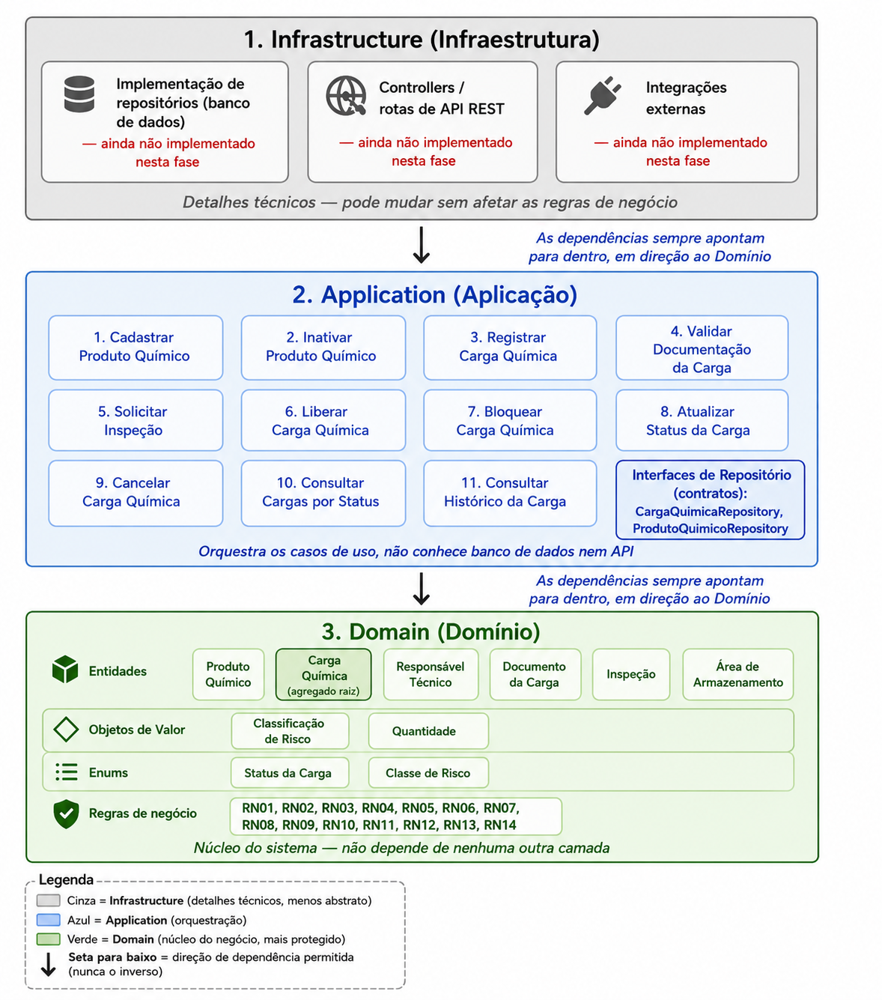

# Diagrama de Arquitetura em Camadas — QuimiPort

## Objetivo

Este diagrama representa visualmente a arquitetura em camadas do
QuimiPort, mostrando as três camadas (Infrastructure, Application, Domain),
o que cada uma contém e a direção permitida de dependência entre elas. É a
representação visual do que está descrito em
`docs/04-arquitetura/arquitetura-proposta.md` e nos ADRs em
`docs/04-arquitetura/decisoes-arquiteturais/`.

## Diagrama

## Camadas

### 1. Infrastructure (Infraestrutura)

Detalhes técnicos do sistema — ainda não implementados nesta fase:

- Implementação de repositórios (banco de dados)
- Controllers / rotas de API REST
- Integrações externas

> Pode mudar (trocar banco de dados, framework web) sem afetar as regras
> de negócio.

### 2. Application (Aplicação)

Orquestra os 11 casos de uso do sistema (UC01 a UC11), definidos em
`docs/02-casos-de-uso/casos-de-uso.md`, e as interfaces de repositório
(`CargaQuimicaRepository`, `ProdutoQuimicoRepository`) — contratos que a
Infrastructure implementará nas próximas fases.

> Não conhece banco de dados nem API; depende apenas do Domain.

### 3. Domain (Domínio)

Núcleo do sistema — não depende de nenhuma outra camada:

- **Entidades:** Produto Químico, Carga Química (agregado raiz),
  Responsável Técnico, Documento da Carga, Inspeção, Área de Armazenamento
- **Objetos de Valor:** Classificação de Risco, Quantidade
- **Enums:** Status da Carga, Classe de Risco
- **Regras de negócio:** RN01 a RN14

## Legenda

- **Cinza** — Infrastructure (detalhes técnicos, menos abstrato)
- **Azul** — Application (orquestração)
- **Verde** — Domain (núcleo do negócio, mais protegido)
- **Verde mais escuro** — destaque para Carga Química, o agregado raiz
- **Seta para baixo** — direção de dependência permitida: Infrastructure →
  Application → Domain (nunca o inverso)

## Notas de leitura

- A regra de dependência é a peça central da arquitetura: camadas mais
  externas dependem das mais internas, nunca o contrário. Isso está
  detalhado no ADR 001 (`adr-001-separacao-em-camadas.md`).
- Por isso o Domain pode ser testado isoladamente, sem depender de banco
  de dados, API ou qualquer framework — só precisa das próprias regras de
  negócio.
- A Infrastructure é a única camada que ainda não existe nesta fase; será
  implementada nas próximas fases seguindo a estratégia descrita no ADR
  003 (`adr-003-estrategia-de-evolucao.md`).
