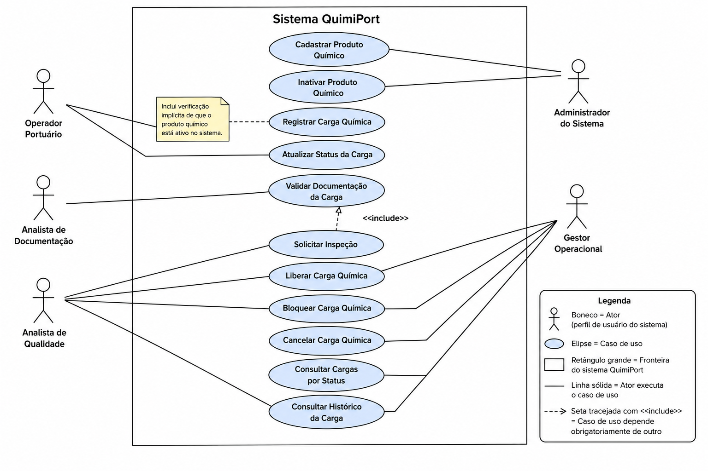

# Diagrama de Casos de Uso — QuimiPort

## Objetivo

Este diagrama representa visualmente os atores do sistema e os casos de
uso que cada um executa, incluindo o relacionamento `<<include>>` entre
casos de uso dependentes. É a representação visual do que está descrito em
`docs/02-casos-de-uso/casos-de-uso.md`.

## Diagrama

## Atores

- **Operador Portuário**
- **Analista de Documentação**
- **Analista de Qualidade**
- **Gestor Operacional**
- **Administrador do Sistema**

> O ator Responsável Técnico não executa ações diretamente no sistema
> nesta fase — aparece apenas como referência dentro da Carga Química
> (ver `docs/01-dominio/entidades.md`), por isso foi omitido deste
> diagrama.

## Casos de uso por ator

| Ator | Casos de uso |
|---|---|
| Administrador do Sistema | Cadastrar Produto Químico (UC01), Inativar Produto Químico (UC02) |
| Operador Portuário | Registrar Carga Química (UC03), Atualizar Status da Carga (UC08) |
| Analista de Documentação | Validar Documentação da Carga (UC04) |
| Analista de Qualidade | Solicitar Inspeção (UC05), Liberar Carga Química (UC06), Bloquear Carga Química (UC07), Consultar Cargas por Status (UC10), Consultar Histórico da Carga (UC11) |
| Gestor Operacional | Liberar Carga Química (UC06), Bloquear Carga Química (UC07), Cancelar Carga Química (UC09), Consultar Cargas por Status (UC10), Consultar Histórico da Carga (UC11) |

## Relacionamento `<<include>>`

- **Liberar Carga Química** inclui obrigatoriamente **Validar Documentação
  da Carga** — a liberação depende da documentação estar completa e
  validada (RN09).

## Nota adicional

- **Registrar Carga Química** possui uma nota indicando que o caso de uso
  inclui uma verificação implícita de que o produto químico está ativo no
  sistema (RN05), sem necessidade de uma elipse `<<include>>` separada
  para essa checagem simples.

## Legenda

- **Boneco** — Ator (perfil de usuário do sistema).
- **Elipse** — Caso de uso.
- **Retângulo grande** — Fronteira do sistema QuimiPort.
- **Linha sólida** — Ator executa o caso de uso.
- **Seta tracejada com `<<include>>`** — Caso de uso depende
  obrigatoriamente de outro.

## Notas de leitura

- Casos de uso de consulta (UC10, UC11) são compartilhados entre Gestor
  Operacional e Analista de Qualidade, refletindo que ambos os perfis
  acompanham o status e o histórico das cargas no dia a dia.
- Liberar e Bloquear Carga Química (UC06, UC07) também são compartilhados
  entre Analista de Qualidade e Gestor Operacional, já que ambos podem
  tomar essa decisão operacional conforme o contexto.
- Nenhuma regra de negócio é aplicada nos casos de uso de consulta (UC10,
  UC11) — são apenas leitura, conforme `docs/02-casos-de-uso/casos-de-uso.md`.
