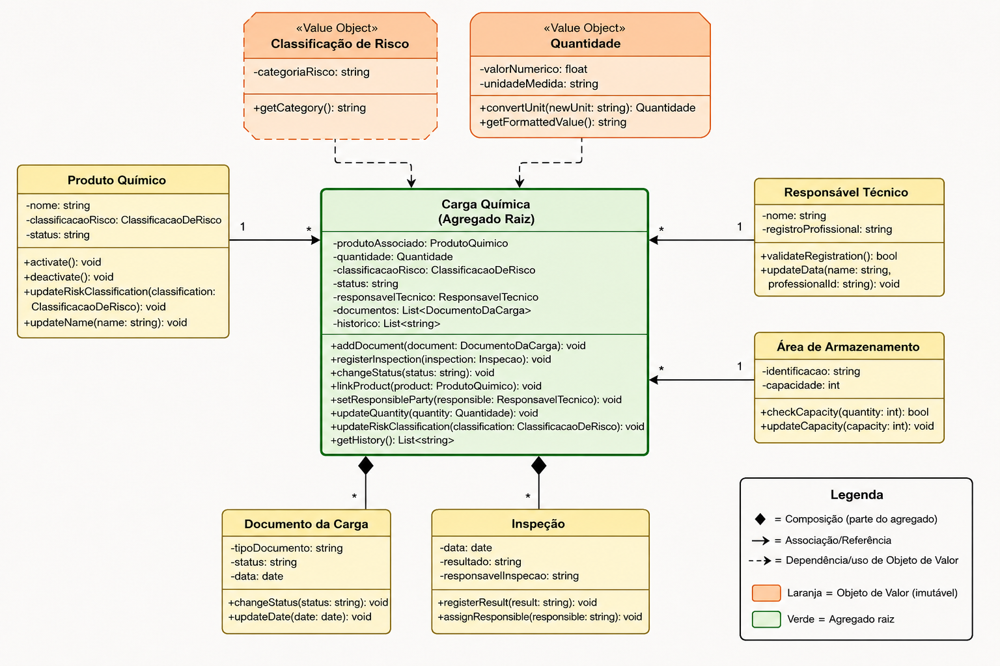

# Diagrama de Domínio — QuimiPort

## Objetivo

Este diagrama representa o modelo de domínio do QuimiPort: os agregados,
entidades e objetos de valor identificados, com seus atributos, métodos e
relacionamentos. Ele é a representação visual do que está descrito em
`docs/01-dominio/entidades.md`, `objetos-de-valor.md` e `agregados.md`.

## Diagrama

## Legenda

- **◆ Losango preenchido** — Composição: a parte pertence ao agregado e não
  existe sem ele (ex.: Documento da Carga e Inspeção pertencem à Carga
  Química).
- **→ Seta simples** — Associação/Referência entre agregados ou entidades
  independentes (ex.: Carga Química referencia Produto Químico, Responsável
  Técnico e Área de Armazenamento, sem possuí-los).
- **- - → Linha tracejada** — Dependência/uso de um Objeto de Valor.
- **Laranja (estereótipo «Value Object»)** — Objeto de Valor: sem
  identidade própria, imutável (Classificação de Risco e Quantidade).
- **Verde** — Agregado raiz (Carga Química).

## Notas de leitura

- **Carga Química** é o agregado raiz: concentra e protege as regras de
  negócio mais críticas do domínio (não liberar sem documentação, não
  movimentar carga bloqueada, não liberar carga cancelada, etc.). Toda
  alteração de estado passa pelos métodos desse agregado
  (`changeStatus`, `updateQuantity`,
  `updateRiskClassification`, entre outros).
- **Produto Químico** é um agregado separado, com ciclo de vida próprio
  (cadastro, ativação, inativação), por isso é apenas **referenciado** pela
  Carga Química, e não composto por ela.
- **Documento da Carga** e **Inspeção** existem apenas em função de uma
  Carga Química específica, por isso são tratados como **composição**: não
  fazem sentido fora do agregado.
- **Classificação de Risco** e **Quantidade** são **Objetos de Valor**:
  imutáveis, sem identidade própria, comparados apenas pelo conteúdo. Para
  "alterar" um desses valores em uma Carga Química, o agregado substitui a
  referência inteira, em vez de mutar o objeto existente.

## Multiplicidades principais

| Relacionamento | Cardinalidade |
|---|---|
| Produto Químico → Carga Química | 1 → N |
| Responsável Técnico → Carga Química | 1 → N |
| Área de Armazenamento → Carga Química | 1 → N |
| Carga Química → Documento da Carga | 1 → N |
| Carga Química → Inspeção | 1 → N |
