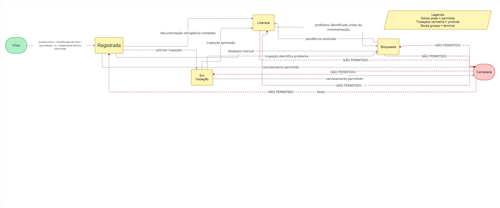

# Fluxo de Transição de Status — Carga Química (QuimiPort)

## Objetivo

Este diagrama representa as transições permitidas e proibidas do campo
"status" da Carga Química, refletindo as regras de negócio definidas em
`docs/03-regras-de-negocio/regras-de-negocio.md` (RN09 a RN12 e RN14).

## Diagrama

## Estados possíveis

- Registrada
- Em Inspeção
- Liberada
- Bloqueada
- Cancelada (estado terminal)

## Transições permitidas

| De | Para | Condição / Regra |
|---|---|---|
| *(início)* | Registrada | Produto ativo, Classificação de Risco, quantidade > 0, Responsável Técnico informado (RN04–RN08, RN13) |
| Registrada | Em Inspeção | Solicitação de inspeção (UC05) |
| Registrada | Liberada | Documentação obrigatória completa (RN09) |
| Registrada | Bloqueada | Bloqueio manual (UC07) |
| Registrada | Cancelada | Cancelamento permitido (RN14) |
| Em Inspeção | Liberada | Inspeção aprovada — não finaliza sem passar por liberação (RN12) |
| Em Inspeção | Bloqueada | Inspeção identifica problema |
| Em Inspeção | Cancelada | Cancelamento permitido (RN14) |
| Liberada | Bloqueada | Problema identificado antes da movimentação |
| Bloqueada | Liberada | Pendência resolvida |

## Transições proibidas

| De | Para | Motivo |
|---|---|---|
| Liberada | Cancelada | Só é permitido cancelar em "Registrada" ou "Em Inspeção" (RN14) |
| Bloqueada | Cancelada | Mesma razão acima (RN14) |
| Cancelada | Qualquer outro estado | Estado terminal — carga cancelada não pode ser liberada nem reaberta (RN11) |

## Legenda

- **Seta sólida** — transição permitida.
- **Seta tracejada/vermelha** — transição proibida (representada apenas
  para reforçar visualmente as regras RN11 e RN14; não corresponde a uma
  ação real executada pelo sistema).
- **Cor diferente (vermelho/rosa)** — estado terminal (Cancelada).

## Notas de leitura

- O estado **Cancelada** é terminal: nenhuma transição sai dele. As setas
  proibidas partindo de Cancelada no diagrama existem apenas para deixar
  explícita a regra RN11, não como ações possíveis.
- A regra RN14 (cancelamento só em "Registrada" ou "Em Inspeção") foi uma
  decisão de escopo do grupo: nesta fase, o sistema não distingue "carga
  liberada parada" de "carga fisicamente em movimentação" — por isso, uma
  vez liberada ou bloqueada, a carga não pode mais ser cancelada.
